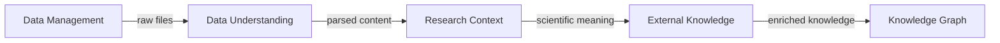

# SciDK Plugin Taxonomy and Architecture

## Core Insight: Plugin Categories by Research Workflow

Instead of technical categories, organize plugins by how researchers think about their work:

---

## 1. Refined Plugin Categories

### 1.1 **Data Management** (Where is my data?)
*Finding, moving, organizing, and archiving research data*

```yaml
Plugins:
  DataManager:  # Combined filesystem + archive tool
    capabilities:
      - Filesystem scanning (active data)
      - Archive management (cold storage)
      - Transfer operations (rsync, Globus, rclone)
      - Storage optimization
      - Version tracking
    
    knowledge_contribution:
      nodes: [Dataset, Archive, Transfer, Version]
      relationships: [STORED_IN, ARCHIVED_FROM, TRANSFERRED_TO, VERSIONED_AS]
    
    operations:
      discovery:
        - Scan filesystems recursively
        - Index file metadata
        - Track file changes
      
      processing:
        - Move/copy/archive data
        - Compress/decompress
        - Validate checksums
        - Create manifests
      
      lifecycle:
        - Tag as: active, staging, archived, deprecated
        - Track provenance
        - Monitor storage quotas
```

### 1.2 **Data Understanding** (What's in my data?)
*Parsing, extracting, and understanding file contents*

```yaml
Plugins:
  TableParser:  # CSV, Excel, TSV analysis
    capabilities:
      - Schema inference
      - Statistical summaries  
      - Column profiling
      - Relationship detection
    
  ImageAnalyzer:  # Microscopy, medical imaging
    capabilities:
      - Metadata extraction (DICOM, TIFF tags)
      - Image statistics
      - Feature detection
      - Thumbnail generation
    
  SequenceAnalyzer:  # Genomics, proteomics
    capabilities:
      - Format detection (FASTA, FASTQ, GenBank)
      - Sequence statistics
      - Quality metrics
      - Annotation extraction
    
  DocumentParser:  # PDFs, Word docs, protocols
    capabilities:
      - Text extraction
      - Method section parsing
      - Reference extraction
      - Protocol identification
```

### 1.3 **Research Context** (How does this connect to science?)
*Domain-specific interpretation and scientific context*

```yaml
Plugins:
  GenomicsContext:  # From OTUs to biological meaning
    requires: SequenceAnalyzer output
    capabilities:
      - Taxonomic classification
      - Phylogenetic placement
      - Functional annotation
      - Pathway mapping
    
  ProteomicsContext:  # From mass spec to proteins
    requires: TableParser output (MaxQuant, etc)
    capabilities:
      - Protein identification
      - PTM analysis
      - Interaction networks
      - Pathway enrichment
    
  ImagingContext:  # From pixels to biology
    requires: ImageAnalyzer output
    capabilities:
      - Segmentation results
      - Feature quantification
      - Spatial analysis
      - Time series tracking
```

### 1.4 **External Knowledge** (What does the world know?)
*Connecting to external databases and literature*

```yaml
Plugins:
  LiteratureConnector:
    sources: [PubMed, bioRxiv, arXiv, Google Scholar]
    capabilities:
      - Paper retrieval
      - Citation networks
      - Method extraction
      - Author networks
    
  DatabaseConnector:
    sources: [UniProt, KEGG, Gene Ontology, NCBI]
    capabilities:
      - ID mapping
      - Annotation retrieval
      - Pathway information
      - Sequence databases
    
  InstitutionalConnector:
    sources: [LIMS, ELN, REDCap, SharePoint]
    capabilities:
      - Sample tracking
      - Protocol retrieval
      - Result linking
      - Project metadata
```

### 1.5 **Compliance & Methods** (Am I doing this right?)
*Protocols, regulations, and experimental design*

```yaml
Plugins:
  ProtocolManager:
    sources: [IACUC, IRB, Biosafety, SOPs]
    capabilities:
      - Protocol tracking
      - Compliance checking
      - Usage monitoring
      - Expiration alerts
    
  ExperimentDesigner:
    sources: [NC3Rs EDA, Power analysis tools]
    capabilities:
      - Study design
      - Sample size calculation
      - Randomization schemes
      - Statistical planning
```

### 1.6 **Facility Operations** (How do I use core resources?)
*Core facility scheduling, tracking, and results*

```yaml
Plugins:
  FacilityScheduler:
    facilities: [Imaging, Genomics, Proteomics, Flow]
    capabilities:
      - Instrument booking
      - Queue management
      - Result delivery
      - Usage tracking
    
  FacilityDataConnector:
    capabilities:
      - Auto-import results
      - Link to projects
      - QC metrics
      - Billing integration
```

---

## 2. Plugin Interaction Patterns

### 2.1 Processing Pipeline



### 2.2 Real Example: Genomics Workflow

```python
# User uploads sequencing results
DataManager.scan("/data/sequencing/run_2024_03/")
  ↓ discovers: 96 FASTQ files

SequenceAnalyzer.parse(fastq_files)
  ↓ extracts: sequences, quality scores, read counts

GenomicsContext.classify(sequences)
  ↓ identifies: OTUs, taxonomic assignments

DatabaseConnector.enrich(taxa)
  ↓ adds: NCBI taxonomy, metabolic pathways

LiteratureConnector.find_similar(otu_profile)
  ↓ finds: similar published microbiomes

# Result: Complete knowledge from raw files to scientific context
```

---

## 3. Plugin Development Complexity Levels

### Level 1: Simple Discovery (Easy)
*Most facility staff can build these*

```python
class BasicDiscoveryPlugin:
    """Just find and catalog files"""
    
    def discover_data(self, path):
        # Scan directory
        # Extract basic metadata
        # Add to knowledge graph
        return discovered_items
```

**Examples**: File scanner, Google Drive connector, FTP monitor

### Level 2: Format Parsing (Moderate)
*Staff scientists with domain knowledge*

```python
class FormatParserPlugin:
    """Parse specific file formats"""
    
    def parse_file(self, filepath):
        # Read specialized format
        # Extract structured data
        # Validate against schema
        return parsed_data
```

**Examples**: MaxQuant parser, DICOM reader, Flow cytometry FCS parser

### Level 3: Scientific Analysis (Advanced)
*Bioinformaticians, data scientists*

```python
class AnalysisPlugin:
    """Perform scientific analysis"""
    
    def analyze_data(self, parsed_data):
        # Statistical analysis
        # Machine learning
        # Complex algorithms
        return analysis_results
```

**Examples**: Phylogenetic analysis, Image segmentation, Pathway enrichment

---

## 4. Unified Data Management Plugin

### Combining Filesystem + Archive into DataManager

```python
class DataManagerPlugin:
    """Unified data lifecycle management"""
    
    def __init__(self):
        self.storage_tiers = {
            'hot': '/data/active',      # Fast SSD, current work
            'warm': '/data/projects',   # Standard storage, recent
            'cold': '/archives',        # Compressed, archived
            'glacier': 's3://backup'    # Cloud, long-term
        }
    
    def discover_all(self):
        """Scan all storage tiers"""
        datasets = []
        for tier, path in self.storage_tiers.items():
            found = self.scan_location(path)
            for dataset in found:
                dataset['storage_tier'] = tier
                dataset['lifecycle_state'] = self.determine_state(dataset)
                datasets.append(dataset)
        return datasets
    
    def determine_state(self, dataset):
        """Classify dataset lifecycle state"""
        age_days = (datetime.now() - dataset['modified']).days
        
        if age_days < 30:
            return 'active'
        elif age_days < 90:
            return 'staging'  
        elif dataset['storage_tier'] == 'cold':
            return 'archived'
        else:
            return 'candidate_for_archive'
    
    def promote_to_active(self, dataset_id):
        """Retrieve from archive to active storage"""
        # Transfer from cold to hot
        # Update knowledge graph
        # Notify user
        pass
    
    def archive_dataset(self, dataset_id):
        """Move from active to archive"""
        # Validate completeness
        # Compress if needed
        # Transfer to cold storage
        # Update knowledge graph
        pass
```

---

## 5. Knowledge Graph Schema by Category

### Category-Specific Node Types

```yaml
Data Management:
  nodes: [Dataset, Archive, StorageLocation, TransferJob]
  properties: [path, size, tier, lifecycle_state]

Data Understanding:
  nodes: [File, Table, Image, Sequence, Document]
  properties: [format, schema, statistics, quality_metrics]

Research Context:
  nodes: [Sample, Experiment, Project, Result]
  properties: [biological_context, experimental_conditions]

External Knowledge:
  nodes: [Paper, Gene, Protein, Pathway, Disease]
  properties: [external_ids, annotations, citations]

Compliance:
  nodes: [Protocol, Approval, Audit, Training]
  properties: [status, expiration, compliance_state]

Facilities:
  nodes: [Instrument, Booking, Service, Result]
  properties: [availability, operator, settings]
```

---

## 6. Smart Plugin Interactions

### Cross-Category Intelligence

When plugins from different categories interact, magic happens:

```python
# User asks: "Is this dataset ready to archive?"

DataManager: "Dataset is 92 days old, 487GB, untouched for 45 days"
    ↓
ProtocolManager: "Linked protocol requires 90-day retention"
    ↓
LiteratureConnector: "Published paper cites this data"
    ↓
ComplianceManager: "NIH grant requires 5-year availability"
    
# System concludes: "Archive to 'warm' storage, not 'glacier'"
```

---

## 7. Plugin Registry Organization

```yaml
Registry Structure:
  categories:
    data_management:
      description: "Find, move, and organize data"
      plugins: [data-manager, cloud-sync, backup-manager]
      
    data_understanding:
      description: "Parse and extract information"
      plugins: [table-parser, image-analyzer, sequence-reader]
      
    research_context:
      description: "Scientific interpretation"
      plugins: [genomics-context, proteomics-analysis, imaging-quantification]
      
    external_knowledge:
      description: "Connect to databases and literature"
      plugins: [pubmed, uniprot, kegg, ncbi]
      
    compliance_methods:
      description: "Protocols and regulations"
      plugins: [iacuc-tracker, sop-manager, nc3rs-eda]
      
    facility_operations:
      description: "Core facility integration"  
      plugins: [imaging-core, genomics-core, mass-spec-core]
```

---

## The Key Insight

By organizing plugins around the **research workflow** rather than technical capabilities, we create a system that:

1. **Makes sense to scientists** - Categories match how they think
2. **Encourages reuse** - One DataManager instead of many file scanners
3. **Enables intelligence** - Plugins in different categories complement each other
4. **Scales naturally** - Add facility-specific plugins without duplicating basics
5. **Simplifies development** - Clear boundaries between processing and analysis

The DataManager handles the "where and how" of data, Understanding plugins handle the "what", and Context plugins handle the "why it matters scientifically".